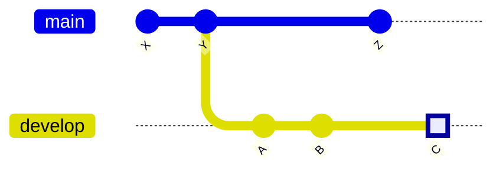

# squash2stash

> Script that squashes your current git branch changes and stashes them.

# Motivation

Like many developers, I found myself creating lots of commits during development with messages like "_WIP_" or "_fixed XYZ_". While these commits helped me track my progress, I realized they:

- Made my commit history messy
- Sometimes turned rebasing into a time-consuming mess

My solution to these problems:

Squash all changes from your working branch into a single change and stash it. You can then:

- Create a new "clean" branch
- Apply the stashed changes
- Create a single, well-documented commit
- Rebase if needed

# Installation

Put this into your `.zshrc`:

```sh
squash2stash() {
        local target_branch=${1:-origin/main}
        git fetch
        local main_commit="$(git merge-base HEAD $target_branch)"
        local current_branch="$(git rev-parse --abbrev-ref HEAD)"
        git switch -c temp/squash2stash # create temporary branch to not change current branch directly
        git reset --soft "$main_commit"
        git stash
        git switch $current_branch
        git branch -d temp/squash2stash
}
```

# Usage

1. checkout the branch you want to squash to stash
2. run `squash2stash [source branch]`
   (The source branch is typically the branch you created your current branch out of)
3. All the changes you made since branching are stashed now

# Is it safe?

Your own branches will never be touched by this command. So it should be safe to use.

# How it works

Imagine you created a develop branch that has committed changes A, B & C. And you have currently checked out develop at the square.



If you use the following command:

```
squash2stash main
```

All the commits of the current branch will be squashed and stashed (in this case: A, B, C). It will not include the commits that are common with the source branch (in this case the as argument provided main branch and commits: X, Y)
