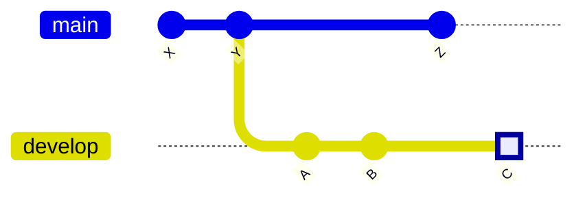

# squash2stash

> A script that squashes your current git branch changes and stashes them.

# Motivation

Like many developers, I often create multiple commits during development with messages like "_WIP_" or "_fixed XYZ_". While these commits help track progress, I discovered they:

- Create a messy commit history
- Can make rebasing unnecessarily complex

My solution:

Squash all changes from your working branch into a single change and stash it. This allows you to:

- Create a fresh, "clean" branch
- Apply the stashed changes
- Make a single, well-documented commit
- Rebase with ease

# Installation

Add this to your `.zshrc`:

```sh
squash2stash() {
        local target_branch=${1:-origin/main}
        git fetch
        local main_commit="$(git merge-base HEAD $target_branch)"
        local current_branch="$(git rev-parse --abbrev-ref HEAD)"
        git switch -c temp/squash2stash # create temporary branch to not change current branch directly
        git reset --soft "$main_commit"
        git stash
        git switch $current_branch
        git branch -d temp/squash2stash
}
```

# Usage

1. Checkout the branch you want to squash and stash
2. Run `squash2stash [source branch]`
   (The source branch is typically the branch you branched from)
3. All changes made since branching will now be in your stash

# Is it safe?

This command never modifies your existing branches, making it safe to use.

# How it works

Consider a develop branch with commits A, B & C. You're currently on develop at the square marker.



When you run:

```
squash2stash main
```

All commits in your current branch (A, B, C) will be squashed and stashed. Commits shared with the source branch (X, Y from main) will not be stashed.
